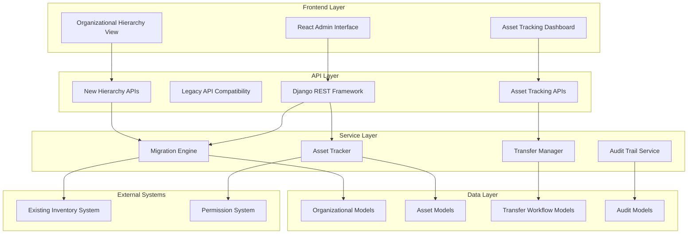

# Design Document: Hidroven Organizational Restructuring with Asset Traceability System

## Overview

The Hidroven Organizational Restructuring with Asset Traceability System transforms the existing flat organizational structure into a hierarchical enterprise model while implementing comprehensive asset tracking across 9 regional warehouses. The system leverages Django's MPTT (Modified Preorder Tree Traversal) for efficient hierarchical queries and implements a dual-approval workflow for asset transfers with evolving asset codes that maintain complete movement history.

The design maintains backward compatibility with existing APIs during migration while introducing new capabilities for asset traceability, organizational hierarchy management, and automated inventory synchronization. The system supports up to 100,000 individual assets across the regional warehouse network with complete audit trails and performance optimization for hierarchical queries.

## Architecture

### High-Level Architecture



### Migration Strategy

The system implements a phased migration approach:

1. **Phase 1**: Create new hierarchical models alongside existing ones
2. **Phase 2**: Migrate data while maintaining dual-write capability
3. **Phase 3**: Switch read operations to new hierarchy
4. **Phase 4**: Deprecate old models and complete migration

This approach ensures zero-downtime migration with rollback capability at each phase.

## Components and Interfaces

### Migration Engine

The Migration Engine handles the transformation from flat to hierarchical organizational structure.

**Core Responsibilities:**
- Create new hierarchical organizational structure
- Migrate existing data with integrity validation
- Maintain API compatibility during transition
- Provide rollback capabilities
- Handle permission inheritance

**Key Methods:**
```python
class MigrationEngine:
    def create_hidroven_hierarchy() -> Empresa
    def migrate_organizational_data() -> MigrationResult
    def validate_migration_integrity() -> ValidationResult
    def rollback_migration(checkpoint: str) -> RollbackResult
    def update_permission_inheritance() -> None
```

### Asset Tracker

The Asset Tracker manages individual asset lifecycle and code generation.

**Core Responsibilities:**
- Generate unique evolving asset codes
- Track asset states and locations
- Manage asset-warehouse relationships
- Synchronize with inventory system
- Validate asset operations

**Key Methods:**
```python
class AssetTracker:
    def generate_asset_code(warehouse: str, asset_type: str) -> str
    def evolve_asset_code(current_code: str, new_warehouse: str) -> str
    def update_asset_state(asset_id: str, new_state: AssetState) -> None
    def get_asset_history(asset_id: str) -> List[MovementRecord]
    def validate_asset_code(code: str) -> bool
```

### Transfer Manager

The Transfer Manager implements the dual-approval workflow for asset transfers.

**Core Responsibilities:**
- Create and manage transfer requests
- Handle dual approval workflow
- Execute approved transfers
- Update asset codes and locations
- Notify stakeholders

**Key Methods:**
```python
class TransferManager:
    def create_transfer_request(asset_id: str, origin: str, destination: str) -> TransferRequest
    def approve_transfer(request_id: str, approver: User) -> ApprovalResult
    def reject_transfer(request_id: str, approver: User, reason: str) -> RejectionResult
    def execute_transfer(request_id: str) -> TransferResult
    def get_pending_approvals(warehouse: str) -> List[TransferRequest]
```

### Audit Trail Service

The Audit Trail Service maintains immutable records of all system operations.

**Core Responsibilities:**
- Record all asset movements and state changes
- Track approval decisions and workflow states
- Provide audit reporting capabilities
- Ensure data immutability
- Support compliance requirements

**Key Methods:**
```python
class AuditTrailService:
    def record_asset_movement(asset_id: str, movement_data: MovementData) -> AuditRecord
    def record_state_change(asset_id: str, old_state: str, new_state: str) -> AuditRecord
    def record_approval_decision(request_id: str, decision_data: DecisionData) -> AuditRecord
    def generate_audit_report(filters: AuditFilters) -> AuditReport
    def validate_audit_integrity() -> IntegrityResult
```

## Data Models

### Organizational Hierarchy Models

The new organizational structure uses Django MPTT for efficient tree operations:

```python
from mptt.models import MPTTModel, TreeForeignKey

class Empresa(MPTTModel):
    """Root company model - Hidroven"""
    nombre = models.CharField(max_length=200)
    codigo = models.CharField(max_length=10, unique=True)
    parent = TreeForeignKey('self', on_delete=models.CASCADE, null=True, blank=True)
    
    class MPTTMeta:
        order_insertion_by = ['nombre']

class Vicepresidencia(MPTTModel):
    """Three VP types: Comercialización, Operaciones Hídricas, Administrativa"""
    empresa = models.ForeignKey(Empresa, on_delete=models.CASCADE)
    nombre = models.CharField(max_length=200)
    tipo = models.CharField(max_length=50, choices=VP_TYPES)
    parent = TreeForeignKey('self', on_delete=models.CASCADE, null=True, blank=True)
    
    class MPTTMeta:
        order_insertion_by = ['nombre']

class UnidadOrganizacional(MPTTModel):
    """Generic organizational units under VPs"""
    vicepresidencia = models.ForeignKey(Vicepresidencia, on_delete=models.CASCADE)
    nombre = models.CharField(max_length=200)
    tipo = models.CharField(max_length=50)
    parent = TreeForeignKey('self', on_delete=models.CASCADE, null=True, blank=True)
    
    class MPTTMeta:
        order_insertion_by = ['nombre']

class AlmacenRegional(models.Model):
    """9 regional warehouses under VP Operations"""
    unidad_organizacional = models.ForeignKey(UnidadOrganizacional, on_delete=models.CASCADE)
    nombre = models.CharField(max_length=200)
    prefijo = models.CharField(max_length=3, unique=True)  # ZUL, CAR, MIR, etc.
    ubicacion = models.CharField(max_length=200)
    manager = models.ForeignKey(User, on_delete=models.SET_NULL, null=True)
    capacidad_maxima = models.IntegerField(default=10000)
    activo = models.BooleanField(default=True)
```

### Asset Tracking Models

Individual asset tracking with evolving codes and complete history:

```python
class ActivoInventario(models.Model):
    """Individual asset with unique evolving code"""
    codigo_actual = models.CharField(max_length=100, unique=True)
    codigo_original = models.CharField(max_length=100)
    tipo_activo = models.CharField(max_length=50)
    descripcion = models.TextField()
    almacen_actual = models.ForeignKey(AlmacenRegional, on_delete=models.CASCADE)
    estado = models.CharField(max_length=20, choices=ASSET_STATES)
    fecha_ingreso = models.DateTimeField(auto_now_add=True)
    valor_unitario = models.DecimalField(max_digits=12, decimal_places=2)
    numero_serie = models.CharField(max_length=100, blank=True)
    
    # Relationship to existing inventory models
    producto_inventario = models.ForeignKey('inventory.Product', on_delete=models.CASCADE)
    
    class Meta:
        indexes = [
            models.Index(fields=['codigo_actual']),
            models.Index(fields=['almacen_actual', 'estado']),
            models.Index(fields=['tipo_activo', 'estado']),
        ]

class HistorialMovimientoActivo(models.Model):
    """Immutable record of all asset movements"""
    activo = models.ForeignKey(ActivoInventario, on_delete=models.CASCADE)
    almacen_origen = models.ForeignKey(AlmacenRegional, on_delete=models.CASCADE, related_name='movimientos_origen')
    almacen_destino = models.ForeignKey(AlmacenRegional, on_delete=models.CASCADE, related_name='movimientos_destino')
    codigo_anterior = models.CharField(max_length=100)
    codigo_nuevo = models.CharField(max_length=100)
    estado_anterior = models.CharField(max_length=20)
    estado_nuevo = models.CharField(max_length=20)
    fecha_movimiento = models.DateTimeField(auto_now_add=True)
    usuario_responsable = models.ForeignKey(User, on_delete=models.CASCADE)
    motivo = models.TextField()
    solicitud_traslado = models.ForeignKey('SolicitudTraslado', on_delete=models.CASCADE, null=True)
    
    class Meta:
        ordering = ['-fecha_movimiento']
        indexes = [
            models.Index(fields=['activo', '-fecha_movimiento']),
            models.Index(fields=['almacen_origen', '-fecha_movimiento']),
            models.Index(fields=['almacen_destino', '-fecha_movimiento']),
        ]
```

### Transfer Workflow Models

Dual approval workflow implementation:

```python
class SolicitudTraslado(models.Model):
    """Transfer request with dual approval workflow"""
    activo = models.ForeignKey(ActivoInventario, on_delete=models.CASCADE)
    almacen_origen = models.ForeignKey(AlmacenRegional, on_delete=models.CASCADE, related_name='solicitudes_origen')
    almacen_destino = models.ForeignKey(AlmacenRegional, on_delete=models.CASCADE, related_name='solicitudes_destino')
    solicitante = models.ForeignKey(User, on_delete=models.CASCADE)
    fecha_solicitud = models.DateTimeField(auto_now_add=True)
    motivo = models.TextField()
    estado = models.CharField(max_length=20, choices=TRANSFER_STATES, default='PENDIENTE')
    fecha_limite = models.DateTimeField()
    prioridad = models.CharField(max_length=10, choices=PRIORITY_LEVELS, default='NORMAL')
    
    # Approval tracking
    aprobacion_origen = models.ForeignKey('AprobacionTraslado', on_delete=models.SET_NULL, null=True, related_name='solicitudes_origen')
    aprobacion_destino = models.ForeignKey('AprobacionTraslado', on_delete=models.SET_NULL, null=True, related_name='solicitudes_destino')
    
    # Execution tracking
    fecha_ejecucion = models.DateTimeField(null=True, blank=True)
    ejecutado_por = models.ForeignKey(User, on_delete=models.SET_NULL, null=True, related_name='traslados_ejecutados')
    
    class Meta:
        ordering = ['-fecha_solicitud']
        indexes = [
            models.Index(fields=['estado', '-fecha_solicitud']),
            models.Index(fields=['almacen_origen', 'estado']),
            models.Index(fields=['almacen_destino', 'estado']),
        ]

class AprobacionTraslado(models.Model):
    """Individual approval record in dual approval workflow"""
    solicitud = models.ForeignKey(SolicitudTraslado, on_delete=models.CASCADE)
    aprobador = models.ForeignKey(User, on_delete=models.CASCADE)
    tipo_aprobacion = models.CharField(max_length=10, choices=[('ORIGEN', 'Origen'), ('DESTINO', 'Destino')])
    decision = models.CharField(max_length=10, choices=[('APROBADO', 'Aprobado'), ('RECHAZADO', 'Rechazado')])
    fecha_decision = models.DateTimeField(auto_now_add=True)
    comentarios = models.TextField(blank=True)
    
    class Meta:
        unique_together = ['solicitud', 'tipo_aprobacion']
        indexes = [
            models.Index(fields=['aprobador', '-fecha_decision']),
            models.Index(fields=['decision', '-fecha_decision']),
        ]
```

### Migration Support Models

Models to support safe migration and rollback:

```python
class MigracionOrganizacional(models.Model):
    """Mapping between old and new organizational structures"""
    # Old structure references
    organizacion_central_id = models.IntegerField(null=True)
    sucursal_id = models.IntegerField(null=True)
    acueducto_id = models.IntegerField(null=True)
    
    # New structure references
    empresa = models.ForeignKey(Empresa, on_delete=models.CASCADE, null=True)
    vicepresidencia = models.ForeignKey(Vicepresidencia, on_delete=models.CASCADE, null=True)
    unidad_organizacional = models.ForeignKey(UnidadOrganizacional, on_delete=models.CASCADE, null=True)
    acueducto_nuevo = models.ForeignKey('AcueductoNuevo', on_delete=models.CASCADE, null=True)
    
    # Migration metadata
    fecha_migracion = models.DateTimeField(auto_now_add=True)
    estado_migracion = models.CharField(max_length=20, default='PENDIENTE')
    validado = models.BooleanField(default=False)
    
    class Meta:
        indexes = [
            models.Index(fields=['organizacion_central_id']),
            models.Index(fields=['sucursal_id']),
            models.Index(fields=['acueducto_id']),
        ]
```

## Asset Code Evolution Algorithm

The asset code evolution follows a specific pattern that maintains traceability:

### Initial Code Generation
```
Pattern: {WAREHOUSE_PREFIX}-{ASSET_TYPE}-{SEQUENCE}-{YEAR}
Example: ZUL-BOMBA-000001-2024
```

### Code Evolution on Transfer
```
Pattern: {NEW_WAREHOUSE}-{PREVIOUS_CODE}
Example: CAR-ZUL-BOMBA-000001-2024
```

### Multi-Transfer Evolution
```
After multiple transfers:
ZUL-BOMBA-000001-2024 → CAR-ZUL-BOMBA-000001-2024 → MIR-CAR-ZUL-BOMBA-000001-2024
```

### Code Parsing Algorithm
```python
def parse_asset_code(code: str) -> AssetCodeInfo:
    """Parse asset code to extract movement history"""
    parts = code.split('-')
    
    # Find the original pattern (TYPE-SEQUENCE-YEAR at the end)
    year = parts[-1]
    sequence = parts[-2]
    asset_type = parts[-3]
    
    # Extract warehouse movement history
    warehouses = parts[:-3]
    current_warehouse = warehouses[0] if warehouses else None
    movement_history = warehouses[1:] if len(warehouses) > 1 else []
    
    return AssetCodeInfo(
        current_warehouse=current_warehouse,
        asset_type=asset_type,
        sequence=sequence,
        year=year,
        movement_history=movement_history
    )
```

## Performance Optimization

### Database Indexing Strategy

**Organizational Hierarchy:**
- MPTT fields (lft, rght, tree_id, level) automatically indexed
- Custom indexes on frequently queried fields (codigo, tipo)

**Asset Tracking:**
- Composite indexes on (almacen_actual, estado) for warehouse queries
- Index on codigo_actual for fast asset lookups
- Composite indexes on (activo, fecha_movimiento) for history queries

**Transfer Workflow:**
- Composite indexes on (estado, fecha_solicitud) for pending requests
- Indexes on warehouse foreign keys for manager dashboards

### Query Optimization

**Hierarchical Queries:**
```python
# Efficient descendant queries using MPTT
def get_all_warehouses_under_vp(vp_id):
    vp = Vicepresidencia.objects.get(id=vp_id)
    return AlmacenRegional.objects.filter(
        unidad_organizacional__in=vp.get_descendants(include_self=True)
    )

# Efficient ancestor queries
def get_organizational_path(warehouse_id):
    warehouse = AlmacenRegional.objects.select_related(
        'unidad_organizacional__vicepresidencia__empresa'
    ).get(id=warehouse_id)
    return warehouse.unidad_organizacional.get_ancestors(include_self=True)
```

**Asset Queries:**
```python
# Optimized asset history with prefetch
def get_asset_with_history(asset_id):
    return ActivoInventario.objects.select_related(
        'almacen_actual', 'producto_inventario'
    ).prefetch_related(
        'historialmovimientoactivo_set__almacen_origen',
        'historialmovimientoactivo_set__almacen_destino'
    ).get(id=asset_id)
```

## Correctness Properties

*A property is a characteristic or behavior that should hold true across all valid executions of a system—essentially, a formal statement about what the system should do. Properties serve as the bridge between human-readable specifications and machine-verifiable correctness guarantees.*

### Property 1: Migration Data Preservation
*For any* existing organizational structure with OrganizacionCentral, Sucursal, and Acueducto relationships, migrating to the new hierarchy should preserve all original relationships and data integrity while maintaining backward API compatibility.
**Validates: Requirements 1.2, 1.4, 9.1, 9.4**

### Property 2: Migration Rollback Round-Trip
*For any* organizational structure, migrating then rolling back should restore the exact original state with all relationships and data intact.
**Validates: Requirements 1.5**

### Property 3: Hierarchical Permission Inheritance
*For any* organizational hierarchy, permissions granted at a parent level should be accessible to all descendant organizational units, and permission changes at parent level should cascade to all children.
**Validates: Requirements 1.7, 8.1, 8.2, 8.4, 8.6**

### Property 4: Warehouse Prefix Uniqueness
*For any* set of regional warehouses, no two warehouses should ever have identical three-letter prefix codes.
**Validates: Requirements 2.2**

### Property 5: Asset Code Generation and Evolution
*For any* asset and warehouse combination, the generated asset code should follow the pattern {WAREHOUSE}-{TYPE}-{SEQUENCE}-{YEAR}, and when transferred, should evolve to {NEW_WAREHOUSE}-{OLD_CODE} while maintaining the original sequence number throughout all transfers.
**Validates: Requirements 3.1, 3.2, 3.5**

### Property 6: Asset Code Uniqueness
*For any* number of assets in the system, no two assets should ever have identical asset codes regardless of generation or evolution operations.
**Validates: Requirements 3.3**

### Property 7: Asset Code Parsing Round-Trip
*For any* valid asset code, parsing the code to extract movement history then reconstructing it should produce an equivalent code structure with correct warehouse sequence and asset information.
**Validates: Requirements 3.6**

### Property 8: Dual Approval Workflow Enforcement
*For any* asset transfer request, the transfer should never execute without receiving approval from both origin warehouse manager and destination warehouse manager, and any rejection should cancel the entire transfer.
**Validates: Requirements 4.2, 4.5, 4.6**

### Property 9: Transfer Execution Completeness
*For any* transfer request that receives dual approval, the system should automatically execute the transfer, update the asset location, evolve the asset code, and update inventory counts atomically.
**Validates: Requirements 4.4, 4.7, 7.1, 7.2, 7.3**

### Property 10: Asset State Transition Validation
*For any* asset state change, the system should validate that the transition follows business rules, record the change with timestamp and responsible user, and enforce state-based restrictions (e.g., preventing transfers for assets in EN_TRANSITO state).
**Validates: Requirements 5.3, 5.2, 5.4**

### Property 11: Comprehensive Audit Trail
*For any* asset operation (movement, state change, approval decision), the system should create an immutable audit record with all required information (timestamp, responsible users, origin/destination) that cannot be modified after creation.
**Validates: Requirements 6.1, 6.2, 6.4, 6.5**

### Property 12: Asset History Completeness
*For any* asset, querying its history should return a complete chronological record of all movements and state changes from creation to current state.
**Validates: Requirements 6.3**

### Property 13: Warehouse Inventory Isolation
*For any* warehouse inventory query, the results should include only assets currently located in that specific warehouse and should maintain separate counts for each asset type.
**Validates: Requirements 2.6, 7.5**

### Property 14: Data Validation Enforcement
*For any* system operation involving asset codes, warehouse references, or organizational hierarchy relationships, invalid data should be rejected with appropriate error logging while valid data should be accepted and processed correctly.
**Validates: Requirements 11.1, 11.2, 11.3, 11.6**

### Property 15: Referential Integrity Protection
*For any* warehouse containing active assets, deletion attempts should be prevented, and asset moves to incompatible warehouses should be rejected based on capacity and compatibility rules.
**Validates: Requirements 11.4, 11.5**

### Property 16: Report Generation Accuracy
*For any* reporting request, the generated reports should accurately reflect current system state with correct groupings by organizational hierarchy, complete movement information, and accurate utilization calculations.
**Validates: Requirements 12.1, 12.2, 12.3, 12.4**

## Error Handling

### Migration Error Handling

**Data Integrity Failures:**
- Validate all relationships before migration
- Create detailed error logs for failed mappings
- Provide rollback capability at any migration stage
- Maintain data consistency during partial failures

**API Compatibility Issues:**
- Implement graceful degradation for unsupported operations
- Provide clear error messages for deprecated endpoints
- Maintain dual API support during transition period

### Asset Tracking Error Handling

**Code Generation Failures:**
- Implement retry logic with exponential backoff
- Validate code uniqueness before committing
- Log all code generation attempts and failures
- Provide manual code assignment for edge cases

**Transfer Workflow Errors:**
- Handle timeout scenarios for pending approvals
- Implement automatic cleanup for stale requests
- Provide notification retry mechanisms
- Support manual intervention for stuck workflows

**State Transition Errors:**
- Validate all state changes against business rules
- Provide clear error messages for invalid transitions
- Log all attempted state changes for audit purposes
- Support manual state correction by administrators

### System Integration Error Handling

**Inventory Synchronization Failures:**
- Implement eventual consistency with retry mechanisms
- Detect and flag inventory discrepancies
- Provide reconciliation tools for manual correction
- Maintain separate audit trail for sync operations

**Permission System Errors:**
- Handle permission inheritance failures gracefully
- Provide fallback to explicit permission assignment
- Log all permission-related errors for security audit
- Support emergency access procedures

## Testing Strategy

### Dual Testing Approach

The system requires both unit testing and property-based testing to ensure comprehensive coverage:

**Unit Tests:**
- Focus on specific examples and edge cases
- Test integration points between components
- Validate error conditions and boundary cases
- Test specific business rule implementations

**Property-Based Tests:**
- Verify universal properties across all inputs
- Use randomized input generation for comprehensive coverage
- Test invariants and mathematical properties
- Validate system behavior under various conditions

### Property-Based Testing Configuration

**Framework Selection:**
- **Python**: Use Hypothesis for property-based testing
- **Minimum 100 iterations** per property test due to randomization
- Each property test must reference its design document property
- Tag format: **Feature: hidroven-organizational-restructuring, Property {number}: {property_text}**

**Test Categories:**

**Migration Properties:**
```python
@given(organizational_structures())
def test_migration_data_preservation(structure):
    """Feature: hidroven-organizational-restructuring, Property 1: Migration Data Preservation"""
    # Test that migration preserves all relationships and data integrity

@given(organizational_structures())
def test_migration_rollback_round_trip(structure):
    """Feature: hidroven-organizational-restructuring, Property 2: Migration Rollback Round-Trip"""
    # Test that migrate then rollback produces original state
```

**Asset Code Properties:**
```python
@given(warehouses(), asset_types(), sequences(), years())
def test_asset_code_generation_and_evolution(warehouse, asset_type, sequence, year):
    """Feature: hidroven-organizational-restructuring, Property 5: Asset Code Generation and Evolution"""
    # Test code generation follows pattern and evolution maintains sequence

@given(lists(asset_codes(), min_size=2))
def test_asset_code_uniqueness(codes):
    """Feature: hidroven-organizational-restructuring, Property 6: Asset Code Uniqueness"""
    # Test that no two assets have identical codes
```

**Transfer Workflow Properties:**
```python
@given(transfer_requests())
def test_dual_approval_workflow_enforcement(request):
    """Feature: hidroven-organizational-restructuring, Property 8: Dual Approval Workflow Enforcement"""
    # Test that transfers require both approvals and rejections cancel transfers

@given(approved_transfer_requests())
def test_transfer_execution_completeness(request):
    """Feature: hidroven-organizational-restructuring, Property 9: Transfer Execution Completeness"""
    # Test that approved transfers execute completely and atomically
```

**Audit Trail Properties:**
```python
@given(asset_operations())
def test_comprehensive_audit_trail(operation):
    """Feature: hidroven-organizational-restructuring, Property 11: Comprehensive Audit Trail"""
    # Test that all operations create immutable audit records

@given(assets_with_history())
def test_asset_history_completeness(asset):
    """Feature: hidroven-organizational-restructuring, Property 12: Asset History Completeness"""
    # Test that asset history includes all movements from creation to present
```

### Unit Testing Focus Areas

**Migration Testing:**
- Test specific business rule mappings (Sucursal → Vicepresidencia)
- Test API endpoint compatibility with known request/response pairs
- Test rollback scenarios with specific data configurations
- Test permission inheritance for known organizational structures

**Asset Tracking Testing:**
- Test asset code parsing with known code formats
- Test state transition validation with specific state combinations
- Test warehouse capacity validation with known limits
- Test inventory synchronization with specific transfer scenarios

**Workflow Testing:**
- Test approval notification mechanisms
- Test timeout handling for pending requests
- Test concurrent transfer request handling
- Test error recovery scenarios

### Integration Testing

**End-to-End Scenarios:**
- Complete asset lifecycle from creation to disposal
- Full migration process with rollback testing
- Multi-warehouse transfer chains
- Organizational hierarchy changes with permission updates

**Performance Testing:**
- Hierarchical query performance with large datasets
- Asset code generation performance under load
- Audit trail query performance with historical data
- Concurrent transfer processing capabilities

**Security Testing:**
- Permission inheritance validation
- Access control for warehouse operations
- Audit trail immutability verification
- API authentication and authorization

### Test Data Generation

**Organizational Structures:**
```python
@composite
def organizational_structures(draw):
    """Generate valid organizational structures for testing"""
    return draw(builds(
        OrganizationalStructure,
        empresas=lists(empresa_data(), min_size=1, max_size=1),
        vicepresidencias=lists(vp_data(), min_size=3, max_size=3),
        unidades=lists(unidad_data(), min_size=1, max_size=20),
        acueductos=lists(acueducto_data(), min_size=1, max_size=100)
    ))
```

**Asset Codes:**
```python
@composite
def asset_codes(draw):
    """Generate valid asset codes for testing"""
    warehouse = draw(sampled_from(['ZUL', 'CAR', 'MIR', 'ARA', 'LAR', 'TAC', 'BOL', 'ANZ', 'MON']))
    asset_type = draw(sampled_from(['BOMBA', 'TUBERIA', 'VALVULA', 'MEDIDOR']))
    sequence = draw(integers(min_value=1, max_value=999999)).zfill(6)
    year = draw(integers(min_value=2020, max_value=2030))
    return f"{warehouse}-{asset_type}-{sequence}-{year}"
```

**Transfer Requests:**
```python
@composite
def transfer_requests(draw):
    """Generate valid transfer requests for testing"""
    return draw(builds(
        TransferRequest,
        asset=asset_codes(),
        origin_warehouse=warehouse_codes(),
        destination_warehouse=warehouse_codes(),
        priority=sampled_from(['LOW', 'NORMAL', 'HIGH', 'URGENT'])
    ))
```

This comprehensive testing strategy ensures that both specific business requirements and universal system properties are validated through automated testing, providing confidence in system correctness and reliability.