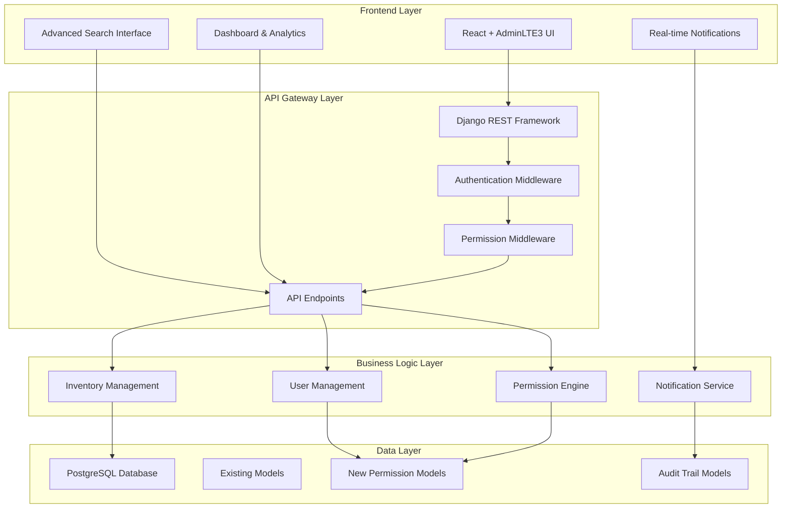

# Design Document: System Modernization

## Overview

This design outlines the modernization of the GSIH (Sistema de Gestión de Inventario de Activos Hidrológicos) Django + React inventory management system. The modernization focuses on four key areas: frontend upgrade to AdminLTE3, comprehensive API coverage, dynamic permission system implementation, and enhanced user experience features.

The design maintains backward compatibility while introducing modern patterns and technologies. The system will transition from hardcoded permissions to a flexible database-driven approach, replace the basic TailwindCSS interface with AdminLTE3 components, and provide comprehensive API coverage for all business operations.

## Architecture

### High-Level Architecture



### Component Integration Strategy

The modernization follows a phased approach where new components integrate with existing ones:

1. **Frontend Migration**: AdminLTE3 components will progressively replace TailwindCSS components
2. **API Enhancement**: New endpoints will be added alongside existing ones, with versioning support
3. **Permission System**: New dynamic permissions will coexist with existing hardcoded permissions during transition
4. **Data Migration**: Existing data structures will be preserved and extended with new fields

## Components and Interfaces

### Frontend Components

#### AdminLTE3 Integration Layer
```typescript
interface AdminLTEConfig {
  theme: 'light' | 'dark' | 'auto';
  sidebar: {
    collapsed: boolean;
    fixed: boolean;
  };
  navbar: {
    fixed: boolean;
    search: boolean;
  };
}

interface DashboardWidget {
  id: string;
  type: 'chart' | 'metric' | 'table' | 'custom';
  title: string;
  data: any;
  refreshInterval?: number;
}
```

#### Data Table Component
```typescript
interface DataTableProps {
  columns: TableColumn[];
  data: any[];
  pagination: PaginationConfig;
  filtering: FilterConfig;
  sorting: SortConfig;
  bulkActions?: BulkAction[];
}

interface TableColumn {
  key: string;
  title: string;
  sortable: boolean;
  filterable: boolean;
  renderer?: (value: any, row: any) => React.ReactNode;
}
```

#### Notification System
```typescript
interface NotificationService {
  subscribe(userId: string, callback: (notification: Notification) => void): void;
  unsubscribe(userId: string): void;
  send(notification: Notification): Promise<void>;
}

interface Notification {
  id: string;
  type: 'info' | 'success' | 'warning' | 'error';
  title: string;
  message: string;
  timestamp: Date;
  read: boolean;
}
```

### Backend API Components

#### Enhanced API Endpoints
```python
class BaseAPIViewSet(viewsets.ModelViewSet):
    """Base viewset with common functionality"""
    pagination_class = CustomPagination
    filter_backends = [DjangoFilterBackend, SearchFilter, OrderingFilter]
    permission_classes = [DynamicPermission]
    
    def get_queryset(self):
        """Apply dynamic filtering and permissions"""
        queryset = super().get_queryset()
        return self.apply_user_permissions(queryset)
    
    @action(detail=False, methods=['post'])
    def bulk_create(self, request):
        """Bulk creation endpoint"""
        pass
    
    @action(detail=False, methods=['patch'])
    def bulk_update(self, request):
        """Bulk update endpoint"""
        pass
    
    @action(detail=False, methods=['delete'])
    def bulk_delete(self, request):
        """Bulk deletion endpoint"""
        pass
```

#### Dynamic Permission System
```python
class Permission(models.Model):
    name = models.CharField(max_length=100, unique=True)
    codename = models.CharField(max_length=100, unique=True)
    content_type = models.ForeignKey(ContentType, on_delete=models.CASCADE)
    description = models.TextField(blank=True)
    
class Role(models.Model):
    name = models.CharField(max_length=50, unique=True)
    description = models.TextField(blank=True)
    permissions = models.ManyToManyField(Permission, through='RolePermission')
    
class RolePermission(models.Model):
    role = models.ForeignKey(Role, on_delete=models.CASCADE)
    permission = models.ForeignKey(Permission, on_delete=models.CASCADE)
    granted = models.BooleanField(default=True)
    conditions = models.JSONField(default=dict, blank=True)
```

#### Advanced Search and Filtering
```python
class AdvancedSearchFilter:
    """Custom filter for advanced search functionality"""
    
    def filter_queryset(self, request, queryset, view):
        search_params = self.parse_search_params(request)
        return self.apply_advanced_filters(queryset, search_params)
    
    def parse_search_params(self, request):
        """Parse complex search parameters"""
        return {
            'text': request.query_params.get('q', ''),
            'filters': json.loads(request.query_params.get('filters', '{}')),
            'date_range': self.parse_date_range(request),
            'categories': request.query_params.getlist('category')
        }
```

### Real-time Communication

#### WebSocket Integration
```python
class NotificationConsumer(AsyncWebsocketConsumer):
    async def connect(self):
        self.user_id = self.scope['user'].id
        self.group_name = f'user_{self.user_id}'
        
        await self.channel_layer.group_add(
            self.group_name,
            self.channel_name
        )
        await self.accept()
    
    async def notification_message(self, event):
        await self.send(text_data=json.dumps({
            'type': 'notification',
            'data': event['data']
        }))
```

## Data Models

### Extended User and Permission Models

```python
class ExtendedUser(AbstractUser):
    """Extended user model with additional fields"""
    roles = models.ManyToManyField(Role, through='UserRole')
    preferences = models.JSONField(default=dict, blank=True)
    last_activity = models.DateTimeField(auto_now=True)
    
class UserRole(models.Model):
    user = models.ForeignKey(ExtendedUser, on_delete=models.CASCADE)
    role = models.ForeignKey(Role, on_delete=models.CASCADE)
    assigned_by = models.ForeignKey(ExtendedUser, on_delete=models.SET_NULL, null=True, related_name='assigned_roles')
    assigned_at = models.DateTimeField(auto_now_add=True)
    expires_at = models.DateTimeField(null=True, blank=True)
```

### Audit Trail Models

```python
class AuditLog(models.Model):
    user = models.ForeignKey(ExtendedUser, on_delete=models.SET_NULL, null=True)
    action = models.CharField(max_length=50)
    content_type = models.ForeignKey(ContentType, on_delete=models.CASCADE)
    object_id = models.PositiveIntegerField()
    object_repr = models.CharField(max_length=200)
    changes = models.JSONField(default=dict)
    timestamp = models.DateTimeField(auto_now_add=True)
    ip_address = models.GenericIPAddressField(null=True, blank=True)
    user_agent = models.TextField(blank=True)
```

### Configuration Models

```python
class SystemConfiguration(models.Model):
    key = models.CharField(max_length=100, unique=True)
    value = models.JSONField()
    description = models.TextField(blank=True)
    category = models.CharField(max_length=50, default='general')
    is_sensitive = models.BooleanField(default=False)
    modified_by = models.ForeignKey(ExtendedUser, on_delete=models.SET_NULL, null=True)
    modified_at = models.DateTimeField(auto_now=True)
```

### Enhanced Inventory Models

```python
class InventoryItem(models.Model):
    # Existing fields preserved
    # New fields for enhanced functionality
    tags = models.ManyToManyField('Tag', blank=True)
    custom_fields = models.JSONField(default=dict, blank=True)
    search_vector = SearchVectorField(null=True, blank=True)
    
    class Meta:
        indexes = [
            GinIndex(fields=['search_vector']),
            models.Index(fields=['created_at', 'status']),
        ]

class Tag(models.Model):
    name = models.CharField(max_length=50, unique=True)
    color = models.CharField(max_length=7, default='#007bff')
    description = models.TextField(blank=True)
```

Now I need to use the prework tool to analyze the acceptance criteria before writing the Correctness Properties section:

<function_calls>
<invoke name="prework">
<parameter name="featureName">system-modernization

## Correctness Properties

*A property is a characteristic or behavior that should hold true across all valid executions of a system—essentially, a formal statement about what the system should do. Properties serve as the bridge between human-readable specifications and machine-verifiable correctness guarantees.*

Based on the prework analysis and property reflection, the following properties ensure system correctness:

### Property 1: Data Table Functionality
*For any* data table in the system, it should provide sorting, filtering, and pagination capabilities that work correctly with any dataset size and maintain consistent behavior across all table instances.
**Validates: Requirements 1.2, 9.4**

### Property 2: Form Validation Consistency
*For any* form in the system, client-side validation should correctly validate all input types according to their validation rules and provide consistent error messaging.
**Validates: Requirements 1.3**

### Property 3: Chart Rendering Reliability
*For any* dataset provided to chart components, the system should render interactive charts correctly and handle edge cases like empty data or invalid data gracefully.
**Validates: Requirements 1.4, 4.5**

### Property 4: Responsive Design Preservation
*For any* viewport size, the user interface should maintain full functionality and proper layout without breaking or losing features.
**Validates: Requirements 1.5**

### Property 5: Notification System Integrity
*For any* system event that triggers notifications, the notification system should deliver messages to the correct users without disrupting their current workflow and display them appropriately.
**Validates: Requirements 1.6, 5.1, 5.4**

### Property 6: API Endpoint Completeness
*For any* Django model in the system, complete CRUD endpoints should be available and function correctly with proper error handling.
**Validates: Requirements 2.1**

### Property 7: Advanced Search Functionality
*For any* search query with filters and parameters, the system should return relevant results with proper highlighting, ranking, and support for complex query syntax.
**Validates: Requirements 2.2, 5.2, 7.1, 7.2, 7.4, 7.5**

### Property 8: Bulk Operations Reliability
*For any* bulk operation request, the system should process multiple records correctly, handle partial failures gracefully, and provide detailed feedback on the operation results.
**Validates: Requirements 2.3**

### Property 9: Report Generation Consistency
*For any* report request, the system should generate comprehensive data in the correct format with all required fields and proper data integrity.
**Validates: Requirements 2.4**

### Property 10: Export Functionality Reliability
*For any* export request, the system should generate valid files in the specified format (PDF, Excel, JSON) with complete data and proper formatting.
**Validates: Requirements 2.5, 4.6, 8.6**

### Property 11: Data Import Validation
*For any* data import operation, the system should validate all imported data, report errors clearly, and maintain data integrity throughout the process.
**Validates: Requirements 2.6**

### Property 12: Permission Storage Integrity
*For any* permission or role data, the system should store it correctly in database tables and maintain referential integrity across all permission-related operations.
**Validates: Requirements 3.1**

### Property 13: Dynamic Permission Evaluation
*For any* user and resource combination, the permission engine should evaluate access rights dynamically from the database and return consistent results.
**Validates: Requirements 3.2**

### Property 14: Granular Permission Control
*For any* permission assignment operation, the system should provide granular control at the module and action level with proper validation.
**Validates: Requirements 3.3**

### Property 15: Permission Conflict Resolution
*For any* conflicting permission scenario, the system should follow the defined precedence hierarchy consistently and resolve conflicts predictably.
**Validates: Requirements 3.5**

### Property 16: Access Control and Logging
*For any* attempt to access restricted resources, the system should deny unauthorized access and log the attempt with complete details.
**Validates: Requirements 3.6**

### Property 17: Comprehensive Audit Trail
*For any* system change (permissions, configurations, data), the audit trail should log all modifications with timestamps, user details, and change descriptions.
**Validates: Requirements 3.4, 5.6, 8.3**

### Property 18: Dashboard KPI Accuracy
*For any* dashboard load, the system should display accurate key performance indicators calculated from current data with proper formatting.
**Validates: Requirements 4.1**

### Property 19: Real-time Data Updates
*For any* dashboard metric, the system should refresh data automatically at specified intervals and reflect changes in real-time.
**Validates: Requirements 4.2**

### Property 20: Interactive Chart Functionality
*For any* chart interaction (drill-down, filtering), the system should respond correctly and provide the expected detailed view or filtered data.
**Validates: Requirements 4.3**

### Property 21: Dashboard Filtering Consistency
*For any* filter applied to dashboard data (date range, category), the system should apply filters correctly and show consistent results across all widgets.
**Validates: Requirements 4.4**

### Property 22: Autocomplete Accuracy
*For any* search input, the system should provide relevant autocomplete suggestions based on existing data and user context.
**Validates: Requirements 7.3**

### Property 23: Search Result Presentation
*For any* search results, the system should highlight matching terms correctly and rank results by relevance using consistent algorithms.
**Validates: Requirements 7.4**

### Property 24: Saved Search Functionality
*For any* saved search pattern, the system should store it correctly and allow users to reuse it with the same results as the original search.
**Validates: Requirements 7.6**

### Property 25: Workflow Routing Accuracy
*For any* workflow approval request, the system should route it to the appropriate approvers based on defined rules and business logic.
**Validates: Requirements 5.5**

### Property 26: Data Migration Integrity
*For any* data migration operation, the system should preserve all existing records and relationships without data loss or corruption.
**Validates: Requirements 6.1**

### Property 27: Authentication Compatibility
*For any* existing JWT token, the system should continue to authenticate users correctly after system upgrades.
**Validates: Requirements 6.2**

### Property 28: Role Mapping Accuracy
*For any* existing hardcoded role, the system should map it correctly to the new dynamic permission system with equivalent access rights.
**Validates: Requirements 6.3**

### Property 29: API Backward Compatibility
*For any* existing API call, the system should continue to work correctly with the new implementation, maintaining the same response format and behavior.
**Validates: Requirements 6.4**

### Property 30: Migration Validation Completeness
*For any* migration validation check, the system should verify data integrity and completeness accurately, identifying any issues or inconsistencies.
**Validates: Requirements 6.6**

### Property 31: Configuration Validation
*For any* configuration change, the system should validate settings correctly and prevent invalid configurations from being saved.
**Validates: Requirements 8.2**

### Property 32: Configuration Profile Support
*For any* environment-specific setting, the system should support multiple configuration profiles and apply the correct settings based on the current environment.
**Validates: Requirements 8.4**

### Property 33: Maintenance Mode Functionality
*For any* maintenance mode activation, the system should correctly block or allow access based on user roles and maintenance settings.
**Validates: Requirements 8.5**

### Property 34: Caching Behavior Consistency
*For any* frequently accessed data, the system should cache it appropriately and serve cached data when beneficial while maintaining data freshness.
**Validates: Requirements 9.5**

### Property 35: Performance Metrics Collection
*For any* system operation, performance metrics should be collected accurately and logged consistently for monitoring purposes.
**Validates: Requirements 9.6**

## Error Handling

### API Error Handling Strategy

The system implements comprehensive error handling across all layers:

1. **Validation Errors**: Client-side validation prevents invalid data submission, while server-side validation provides the final safety net
2. **Permission Errors**: Clear error messages for unauthorized access attempts with appropriate HTTP status codes
3. **Data Integrity Errors**: Database constraint violations are caught and translated to user-friendly messages
4. **External Service Errors**: Graceful degradation when external services are unavailable
5. **Bulk Operation Errors**: Partial failure handling with detailed error reporting for each failed item

### Frontend Error Handling

```typescript
interface ErrorHandler {
  handleAPIError(error: APIError): void;
  handleValidationError(errors: ValidationError[]): void;
  handleNetworkError(error: NetworkError): void;
  showUserFriendlyMessage(message: string, type: 'error' | 'warning'): void;
}
```

### Backend Error Response Format

```python
{
    "error": {
        "code": "VALIDATION_ERROR",
        "message": "Invalid input data",
        "details": {
            "field_errors": {
                "email": ["This field is required"],
                "password": ["Password too weak"]
            }
        },
        "timestamp": "2024-01-15T10:30:00Z",
        "request_id": "req_123456789"
    }
}
```

## Testing Strategy

### Dual Testing Approach

The system employs both unit testing and property-based testing for comprehensive coverage:

**Unit Tests Focus:**
- Specific examples demonstrating correct behavior
- Edge cases and boundary conditions
- Integration points between components
- Error condition handling
- Mock external dependencies

**Property-Based Tests Focus:**
- Universal properties that hold for all inputs
- Comprehensive input coverage through randomization
- Invariant preservation across operations
- Round-trip properties for serialization/deserialization
- Metamorphic properties for complex operations

### Property-Based Testing Configuration

- **Testing Library**: Hypothesis for Python backend, fast-check for TypeScript frontend
- **Minimum Iterations**: 100 iterations per property test
- **Test Tagging**: Each property test references its design document property
- **Tag Format**: `Feature: system-modernization, Property {number}: {property_text}`

### Testing Implementation Strategy

1. **Backend Testing**:
   - Django's TestCase for unit tests
   - Hypothesis for property-based tests
   - Factory Boy for test data generation
   - pytest for test execution and reporting

2. **Frontend Testing**:
   - Jest and React Testing Library for unit tests
   - fast-check for property-based tests
   - Cypress for end-to-end testing
   - Storybook for component testing

3. **Integration Testing**:
   - API endpoint testing with real database
   - WebSocket connection testing
   - Permission system integration tests
   - Data migration validation tests

### Test Coverage Requirements

- Minimum 90% code coverage for critical business logic
- All API endpoints must have integration tests
- All correctness properties must have corresponding property-based tests
- All error conditions must have specific test cases
- Performance tests for critical paths with load simulation