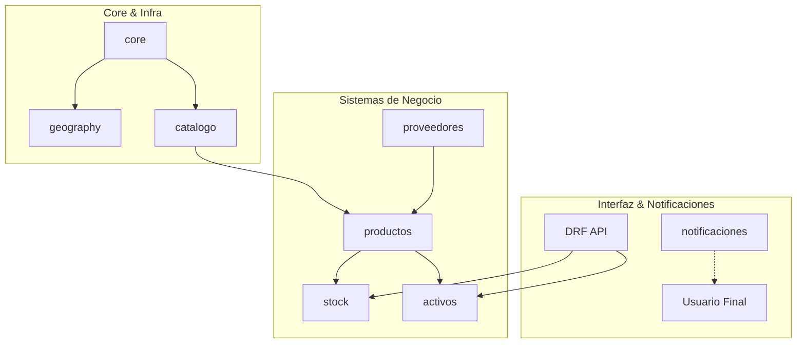

# SIAE - Sistema Integrado de Almacenes y Equipos 💧📦

## 🎯 Propósito del Proyecto
SIAE es una plataforma integral diseñada para la gestión avanzada de recursos e infraestructura hídrica. Su objetivo principal es centralizar y optimizar el control de inventarios hídricos, activos estratégicos y mantenimiento operativo, garantizando la trazabilidad total de los suministros y la continuidad de los servicios institucionales.

---

## 🚀 Características Principales

### 📦 Gestión de Inventario Modular
- **Productos**: Definición técnica de químicos, tuberías, motores y accesorios.
- **Stock**: Control de existencias en tiempo real, lotes y estados operativos.
- **Movimientos**: Gestión de entradas, salidas y transferencias con auditoría avanzada.

### 🏗️ Control de Activos y Mantenimiento
- **Activos Fijos**: Registro detallado de equipos, vida útil y depreciación.
- **Ficha Técnica**: Seguimiento de horas de operación y especificaciones de motores/bombas.
- **Mantenimiento**: Programación y registro de intervenciones preventivas y correctivas.

### 🏢 Gestión de Proveedores
- Aplicación dedicada para la administración de socios comerciales, contactos y trazabilidad de suministros.

### 🔍 Infraestructura Avanzada
- **Búsqueda Facetada**: Filtros técnicos complejos para localización rápida de materiales.
- **Notificaciones en Tiempo Real**: Alertas de stock bajo y aprobaciones vía WebSockets.
- **Auditoría Permanente**: Registro de cada cambio realizado en el sistema para auditoría forense.

---

## 🏗️ Arquitectura del Sistema

El proyecto sigue una arquitectura **Modular Desacoplada** en el backend para facilitar el mantenimiento y la escalabilidad.

### Diagrama de Arquitectura (Nivel de Aplicaciones)

---

## 🛠️ Stack Tecnológico

- **Backend**: Python 3.10+, Django 4.2+, DRF.
- **Frontend**: React, Material UI.
- **Base de Datos**: PostgreSQL (con soporte para GIN Index & Search Vectors).
- **Notificaciones**: Redis + Channels.
- **Contenedores**: Docker & Docker Compose.

---

## 📖 Documentación Detallada
Para más información técnica, consulta nuestra carpeta de documentación:

- [Arquitectura Detallada](file:///c:/Users/gfranco/Desktop/SIAE/docs/technical/ARCHITECTURE.md)
- [Guía de API y Endpoints](file:///c:/Users/gfranco/Desktop/SIAE/docs/technical/API_GUIDE.md)
- [Estructura de Datos y Modelos](file:///c:/Users/gfranco/Desktop/SIAE/docs/technical/DATA_MODEL.md)
- [Guía de Configuración y Despliegue](file:///c:/Users/gfranco/Desktop/SIAE/docs/technical/SETUP.md)